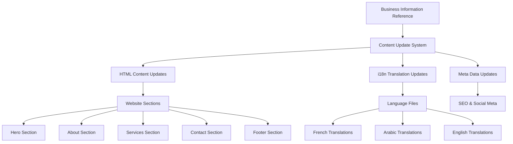

# Design Document

## Overview

This design outlines a systematic approach to update all website content to accurately reflect the true business information for 4K Print (formerly Graphienet). The solution addresses content accuracy across all supported languages (Arabic, French, English) while maintaining the existing i18n system architecture and ensuring consistency across all sections of the website.

**Design Rationale**: The current website contains placeholder or outdated information that doesn't match the actual business details. This comprehensive update will establish a single source of truth for all business information and implement a structured approach to maintain accuracy across multiple languages.

## Architecture

### Content Management Architecture



**Architecture Decision**: Centralized reference document approach ensures all content updates stem from a single authoritative source, reducing inconsistencies and making future updates more manageable.

### Update Strategy

The design follows a **cascading update pattern**:
1. **Reference Document** → Contains all accurate business information
2. **Content Mapping** → Maps reference data to website sections
3. **Multi-language Application** → Applies updates across all supported languages
4. **Validation Layer** → Ensures consistency and accuracy

## Components and Interfaces

### 1. Content Reference System

**Component**: Business Information Reference Document
- **Purpose**: Single source of truth for all business information
- **Location**: `.kiro/specs/content-accuracy-update/business-information-reference.md`
- **Interface**: Structured markdown with clearly defined sections

**Design Decision**: Using a structured reference document allows for easy maintenance and provides clear documentation of what information should appear where on the website.

### 2. HTML Content Update System

**Components**:
- **Hero Section Updates**: Business name, tagline, and value proposition
- **About Section Updates**: Mission, description, location map
- **Services Section Updates**: Accurate service descriptions and offerings
- **Contact Section Updates**: Address, phone, email, business hours
- **Footer Updates**: Consistent business information and social links

**Interface Pattern**:
```html
<!-- Before -->
<element>Generic/Placeholder Content</element>

<!-- After -->
<element data-i18n="section.key">Accurate Business Content</element>
```

### 3. Internationalization (i18n) Update System

**Component**: Translation Management System
- **File**: `i18n.js`
- **Languages**: French (primary), Arabic, English
- **Structure**: Nested object with section-based organization

**Interface Pattern**:
```javascript
{
  'section.subsection.key': {
    fr: 'French translation',
    ar: 'Arabic translation', 
    en: 'English translation'
  }
}
```

**Design Decision**: Maintaining the existing i18n structure ensures compatibility with current language switching functionality while allowing systematic updates.

### 4. Meta Data Update System

**Components**:
- **HTML Meta Tags**: Title, description, keywords
- **Open Graph Tags**: Social media sharing information
- **Structured Data**: Business information for search engines

## Data Models

### Business Information Model

```typescript
interface BusinessInfo {
  identity: {
    name: string;
    previousName?: string;
    tagline: string;
    mission: string;
    description: {
      brief: string;
      detailed: string;
    };
  };
  
  contact: {
    address: {
      street: string;
      city: string;
      country: string;
      mapLink: string;
      embedCode: string;
    };
    phone: string;
    email: string;
    website?: string;
    businessHours: BusinessHours;
  };
  
  services: Service[];
  socialMedia: SocialLinks;
  languages: SupportedLanguage[];
}

interface BusinessHours {
  [day: string]: {
    open: string;
    close: string;
    break?: {
      start: string;
      end: string;
    };
  } | 'closed';
}

interface Service {
  id: string;
  name: string;
  description: string;
  category: string;
}
```

**Design Rationale**: This structured model ensures all business information is consistently represented and can be easily mapped to different website sections.

### Content Mapping Model

```typescript
interface ContentMapping {
  section: string;
  element: string;
  dataSource: keyof BusinessInfo;
  translationKey: string;
  updateType: 'replace' | 'append' | 'attribute';
}
```

## Error Handling

### Content Validation Strategy

1. **Reference Data Validation**
   - Verify all required business information is present
   - Validate contact information format (phone, email)
   - Check social media links accessibility

2. **Translation Consistency Checks**
   - Ensure all translation keys have values in all supported languages
   - Verify character encoding for Arabic text
   - Check RTL layout compatibility

3. **Update Verification**
   - Compare updated content against reference document
   - Validate HTML structure integrity
   - Test i18n functionality after updates

**Error Recovery**: If content updates fail, the system maintains the existing content while logging specific errors for manual review.

### Fallback Mechanisms

- **Missing Translations**: Fall back to primary language (French)
- **Invalid Contact Info**: Display generic contact message with manual review flag
- **Broken Social Links**: Hide non-functional social media links

## Testing Strategy

### Content Accuracy Testing

1. **Reference Verification**
   - Manual review of business information reference document
   - Stakeholder approval of all business details
   - Cross-reference with official business documents

2. **Multi-language Testing**
   - Verify content accuracy in all supported languages
   - Test language switching functionality
   - Validate RTL layout for Arabic content

3. **Cross-section Consistency**
   - Ensure business information is consistent across all website sections
   - Verify contact information matches in header, footer, and contact sections
   - Check service descriptions align between services and about sections

### Functional Testing

1. **i18n System Testing**
   - Test language switching with updated content
   - Verify translation loading performance
   - Check fallback behavior for missing translations

2. **Responsive Design Testing**
   - Ensure updated content displays correctly on all device sizes
   - Test Arabic RTL layout on mobile devices
   - Verify contact information readability

3. **SEO and Meta Data Testing**
   - Validate updated meta tags
   - Test social media sharing with new content
   - Check structured data implementation

### User Acceptance Testing

1. **Business Owner Review**
   - Comprehensive review of all updated business information
   - Approval of service descriptions and business details
   - Verification of contact information and business hours

2. **Multi-language User Testing**
   - Native speakers review translations for accuracy
   - Cultural appropriateness check for different markets
   - Usability testing with target audience

**Testing Rationale**: Comprehensive testing ensures that content updates maintain website functionality while accurately representing the business across all languages and platforms.

## Implementation Considerations

### Content Update Workflow

1. **Preparation Phase**
   - Backup existing content and translations
   - Document current website structure
   - Prepare content mapping templates

2. **Update Phase**
   - Apply HTML content updates section by section
   - Update i18n translations systematically
   - Modify meta data and structured information

3. **Validation Phase**
   - Cross-reference all updates against reference document
   - Test functionality across all supported languages
   - Verify responsive design integrity

### Performance Considerations

- **i18n Loading**: Maintain existing lazy-loading strategy for translations
- **Image Updates**: Optimize any new business images for web performance
- **Caching**: Clear browser caches for updated content visibility

### Maintenance Strategy

- **Reference Document**: Establish process for updating business information reference
- **Translation Management**: Create workflow for maintaining multi-language consistency
- **Regular Audits**: Schedule periodic content accuracy reviews

This design ensures systematic, accurate, and maintainable content updates while preserving the existing website architecture and functionality.