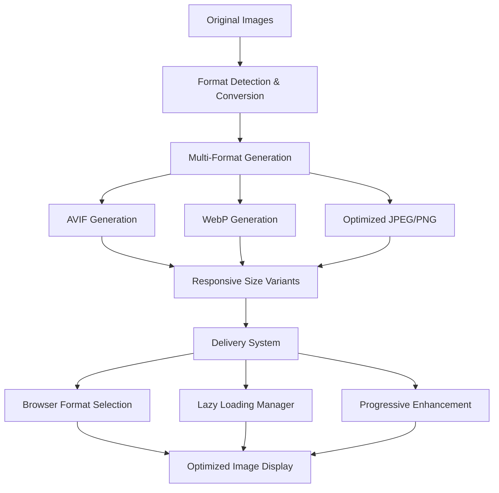

# Design Document

## Overview

This design outlines a comprehensive image optimization system that will significantly improve the website's performance, user experience, and Core Web Vitals scores. The solution implements modern image formats, responsive delivery, progressive loading, and intelligent caching strategies while maintaining backward compatibility and accessibility.

**Design Rationale**: Current image handling is functional but lacks modern optimization techniques. This enhancement will implement industry best practices for image delivery, resulting in faster load times, reduced bandwidth usage, and improved user experience across all devices and connection speeds.

## Architecture

### Image Optimization Pipeline



**Architecture Decision**: Multi-format approach ensures optimal delivery across all browsers while maintaining fallbacks for older browsers.

### Progressive Loading Strategy

The design implements a **three-tier loading approach**:
1. **Placeholder Phase** → Low-quality image placeholder (LQIP) or skeleton
2. **Progressive Phase** → Medium quality image for immediate viewing
3. **Enhancement Phase** → Full quality image for final display

## Components and Interfaces

### 1. Image Format Detection & Conversion System

**Component**: Modern Format Support Detection
- **Purpose**: Detect browser capabilities and serve optimal formats
- **Formats**: AVIF (primary), WebP (secondary), JPEG/PNG (fallback)
- **Interface**: Automatic format selection based on browser support

**Design Decision**: AVIF provides 50% better compression than WebP, WebP provides 25-30% better compression than JPEG.

### 2. Responsive Image Delivery System

**Component**: Multi-Size Image Generation
- **Breakpoints**: 320w, 640w, 960w, 1280w, 1920w, 2560w
- **Density Variants**: 1x, 2x for high-DPI displays
- **Interface Pattern**:
```html
<picture>
  <source srcset="image-320.avif 320w, image-640.avif 640w, ..." type="image/avif">
  <source srcset="image-320.webp 320w, image-640.webp 640w, ..." type="image/webp">
  
</picture>
```

### 3. Progressive Loading Enhancement

**Component**: Enhanced Lazy Loading System
- **Intersection Observer**: Advanced viewport detection with configurable margins
- **Progressive Enhancement**: LQIP → Medium Quality → Full Quality
- **Preloading Strategy**: Intelligent next-image prediction

**Interface Pattern**:
```javascript
class AdvancedImageLoader {
  constructor(options = {}) {
    this.rootMargin = options.rootMargin || '50px';
    this.threshold = options.threshold || 0.1;
    this.enableProgressive = options.progressive || true;
  }
  
  loadImage(element) {
    // Progressive loading implementation
  }
}
```

### 4. Error Handling & Fallback System

**Component**: Robust Error Recovery
- **Retry Logic**: Exponential backoff for failed loads
- **Format Fallback**: Automatic fallback through format hierarchy
- **Placeholder System**: Meaningful error states and retry options

## Data Models

### Image Configuration Model

```typescript
interface ImageConfig {
  src: string;
  alt: string;
  sizes: string;
  formats: {
    avif?: string[];
    webp?: string[];
    jpeg?: string[];
    png?: string[];
  };
  loading: 'lazy' | 'eager' | 'progressive';
  priority: 'high' | 'medium' | 'low';
  aspectRatio?: string;
  placeholder?: {
    type: 'lqip' | 'skeleton' | 'blur';
    data?: string;
  };
}

interface LoadingState {
  status: 'loading' | 'loaded' | 'error' | 'retrying';
  progress?: number;
  currentFormat?: string;
  retryCount: number;
  loadTime?: number;
}
```

### Performance Metrics Model

```typescript
interface ImagePerformanceMetrics {
  lcp: number; // Largest Contentful Paint
  cls: number; // Cumulative Layout Shift
  fid: number; // First Input Delay
  loadTimes: {
    placeholder: number;
    progressive: number;
    final: number;
  };
  bandwidthSaved: number;
  formatUsage: {
    avif: number;
    webp: number;
    jpeg: number;
    png: number;
  };
}
```

## Error Handling

### Progressive Fallback Strategy

1. **Format Fallback Chain**
   - AVIF → WebP → JPEG/PNG
   - Automatic detection and fallback
   - No user intervention required

2. **Loading Failure Recovery**
   - Retry with exponential backoff (1s, 2s, 4s)
   - Format downgrade on persistent failures
   - User-initiated retry options

3. **Network Condition Adaptation**
   - Slow connection detection
   - Quality adjustment based on connection speed
   - Bandwidth-aware loading strategies

### Error State Management

```javascript
const ErrorStates = {
  NETWORK_ERROR: 'network-error',
  FORMAT_UNSUPPORTED: 'format-unsupported', 
  FILE_NOT_FOUND: '404-error',
  TIMEOUT: 'timeout-error',
  GENERIC: 'generic-error'
};
```

## Testing Strategy

### Performance Testing

1. **Core Web Vitals Monitoring**
   - LCP improvement measurement
   - CLS prevention verification
   - FID impact assessment

2. **Load Time Analysis**
   - Before/after comparison
   - Different connection speeds
   - Various device types

3. **Format Support Testing**
   - Cross-browser compatibility
   - Fallback mechanism verification
   - Format selection accuracy

### User Experience Testing

1. **Progressive Loading Validation**
   - Smooth transition verification
   - Placeholder effectiveness
   - Loading state clarity

2. **Error Handling Testing**
   - Network failure scenarios
   - Retry mechanism functionality
   - User feedback quality

3. **Accessibility Testing**
   - Screen reader compatibility
   - Keyboard navigation
   - Alt text effectiveness

### Automated Testing

1. **Performance Regression Tests**
   - Lighthouse CI integration
   - Bundle size monitoring
   - Load time thresholds

2. **Visual Regression Tests**
   - Image display consistency
   - Layout stability
   - Cross-browser rendering

## Implementation Considerations

### Performance Optimizations

- **Critical Path**: Inline critical image CSS
- **Preloading**: Strategic resource hints for above-fold images
- **Caching**: Aggressive caching with proper cache headers
- **Compression**: Optimal quality settings for each format

### Browser Compatibility

- **Modern Browsers**: Full AVIF/WebP support with progressive enhancement
- **Legacy Browsers**: Graceful degradation to JPEG/PNG
- **Feature Detection**: Runtime capability detection

### Content Delivery

- **CDN Integration**: Optimized for image delivery
- **Edge Caching**: Reduced latency for global users
- **Bandwidth Adaptation**: Connection-aware quality adjustment

### Maintenance Strategy

- **Automated Optimization**: Build-time image processing
- **Performance Monitoring**: Real-time metrics collection
- **Regular Audits**: Periodic optimization reviews

This design ensures optimal image performance while maintaining excellent user experience across all devices and network conditions, with comprehensive fallback mechanisms and accessibility support.